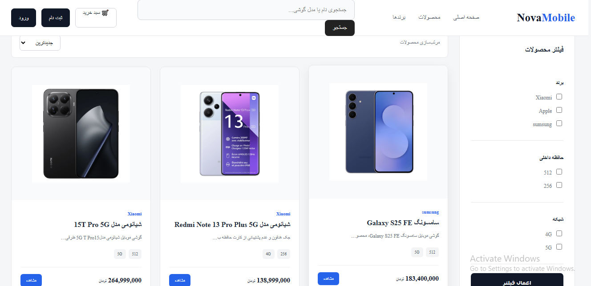
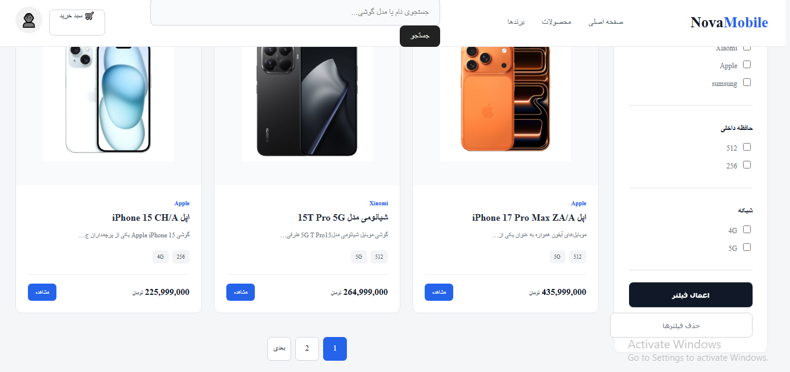
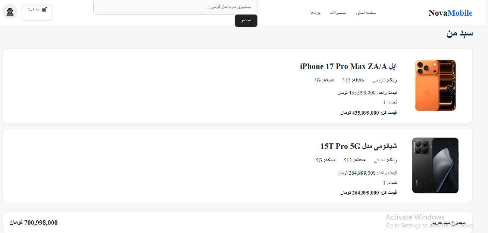
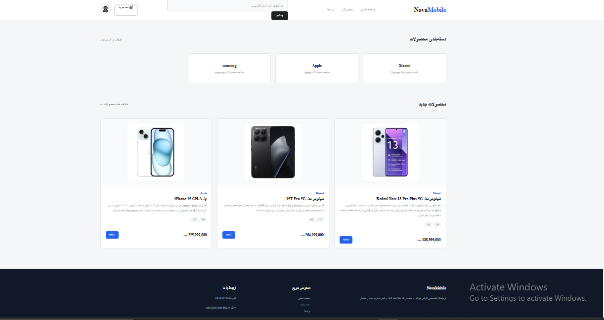

# Django Phones

 

## Features

* Product listing and product detail pages
* Product search across multiple fields
* Product filtering by different attributes
* Product sorting
* Pagination
* Brand and tag filtering
* Dynamic URLs for products and tags
* Shopping cart
* Add and remove products from cart
* User authentication
* User registration, login and logout
* User account section
* Comment system
* Reply to comments
* Authentication-based comment access
* Django messages
* Static and Media file management
* Image upload with `ImageField`

---

##  What I Learned & Implemented

### Django Core

* تسلط به ساختار پروژه و اپلیکیشن‌های Django و معماری MVT
* طراحی و پیاده‌سازی URL Routing و اتصال URLها به Viewها
* پیاده‌سازی Function-Based Viewها
* مدیریت `request` و `response`
* کار با Django Templates و Template Syntax
* استفاده از Template Tagها و Template Filterها
* ارث‌بری قالب‌ها با `base.html`
* ساخت قالب‌های قابل استفاده مجدد
* ساخت و استفاده از Custom Template Tags

### Database & ORM

* کار با Django ORM
* کار با Modelها و QuerySetها
* کار با Django Shell
* طراحی ارتباط بین Modelها و جداول دیتابیس
* استفاده از `ForeignKey`
* استفاده از `related_name`
* استفاده از `null` و `blank`
* پیاده‌سازی Self-Referential Relationship
* مدیریت و اجرای Migrationها
* آشنایی و کار با PostgreSQL

### Forms & Validation

* ساخت `Form` و `ModelForm`
* اعتبارسنجی داده‌ها
* استفاده از `commit=False`
* مدیریت داده‌های ارسال‌شده از طریق Request
* کار با `GET` و `POST`

### Authentication

* پیاده‌سازی Authentication و Authorization
* پیاده‌سازی ورود، خروج و ثبت‌نام کاربران
* استفاده از `AuthenticationForm`
* استفاده از `UserCreationForm`
* مدیریت Session
* Redirect پس از احراز هویت
* محدود کردن برخی قابلیت‌ها بر اساس وضعیت ورود کاربر

### Product & E-commerce

* پیاده‌سازی سیستم فروشگاه محصولات
* طراحی صفحه محصولات
* طراحی صفحه جزئیات محصول
* پیاده‌سازی جستجوی محصولات
* پیاده‌سازی فیلتر محصولات بر اساس چندین ویژگی و فیلد
* پیاده‌سازی Sort و مرتب‌سازی محصولات
* پیاده‌سازی Pagination
* پیاده‌سازی سیستم Tag با `django-taggit`
* فیلتر QuerySet بر اساس Tag
* ایجاد URLهای داینامیک برای Tagها
* پیاده‌سازی سیستم سبد خرید
* افزودن و حذف محصولات از سبد خرید

### Comments

* طراحی سیستم Comment
* ارتباط Comment با User
* پیاده‌سازی Reply برای کامنت‌ها
* ارتباط Self-Referential بین Commentها
* مدیریت وضعیت تأیید کامنت‌ها
* نمایش فرم کامنت برای کاربران احراز هویت‌شده

### Performance & Caching

* آشنایی و کار با Redis
* کار با Redis به‌عنوان Key/Value Store
* کار با Redis Setها
* عملیات پایه Redis مانند:

  * `SET`
  * `GET`
  * `DEL`
  * `EXPIRE`
  * `TTL`
  * `MGET`
  * `MSET`
  * `SADD`
  * `SMEMBERS`
  * `SREM`
  * `SDIFF`
  * `SINTER`
  * `SUNION`
* آشنایی با Caching و مفهوم ذخیره‌سازی موقت داده‌ها

### Project Architecture

* تفکیک منطق Query و دسترسی به داده‌ها در ساختار Selector
* استفاده و یکپارچه‌سازی پکیج‌های شخص ثالث Django
* کار با Django Humanize و Filterهایی مانند `intcomma`
* دیباگ و رفع خطاهای Django با استفاده از Traceback
* تحلیل و رفع خطاهای:

  * `NoReverseMatch`
  * `UnboundLocalError`
  * ORM Errors
  * Template Errors

##  Technologies

* Python
* Django
* PostgreSQL

##  Developer

**Mohammad Aghazadeh**

Backend Developer
Python | Django | PostgreSQL | 
